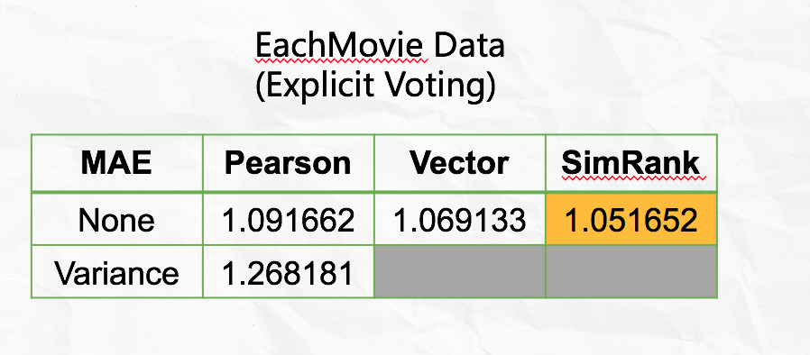
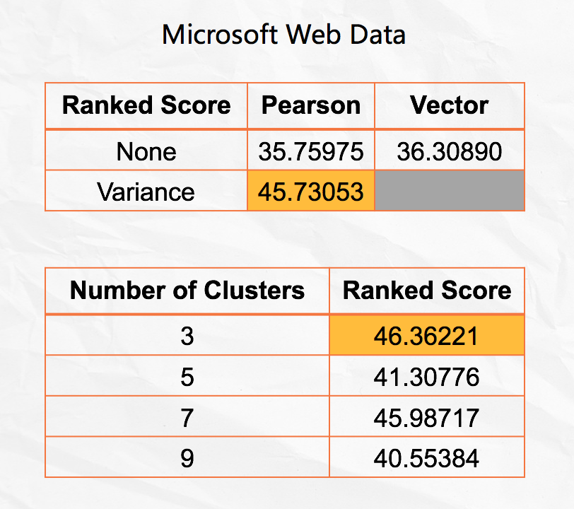

# Project 4: Collaborative Filtering

### [Project Description](doc/project4_desc.md)

Term: Spring 2018

+ Team # 1
+ Projec title: Collaborative Filtering
+ Team members
	+ Cao, Xinlei
	+ Guo, Xiaoxiao
	+ Li, Xinrou
	+ Utomo, Michael
	+ Wang, Jingyi
+ Project summary: The major work of this project is to implement, evaluate and compare algorithms for Collaborative Filtering. First, we implemented the memory-based algorithms. We tried three kinds of similarity weights: Pearson correlation, vector similarity and SimRank. Then we applied variance weighting to Pearson correlation. And the method we used to select neigbors is weight threshold. Next, we did the model-based algorithm. We implemented the EM algorithm in order to solve the cluster model. Here are our results for the performances of these algorithms:



+ Results:
	+ Similarity Weights: For MS data, vector similarity performs better than Pearson correlation; for Movie data, the performances of these three similarity weight are almost the same.
	+ Variance Weighting: For MS data, it improves a lot; for Movie data, it decreases the accuracy.
	+ Model-based Algorithm: It seems that model-based algorithm performs better than momory-based algorithm for MS data.

+ Contribution statement:
	+ Cao, Xinlei: Finished the model based algorithm, coded the EM cluster model in R, predicted the result and writed the evaluation part(rank score) of the EM model, tried the different number of clusters to find the optimal parameters. 
	+ Guo, Xiaoxiao: Processed and cleaned Movie data; Implemented memory-based Algorithms on Movie Dataset(wrote similarity weights, variance weighting, selecting neighbors, prediction, MAE, ROC functions); wrote README.md, main.new.Rmd and memory.new.R document and presentation ppt.
	+ Li, Xinrou: Processed and cleaned Movie data. wrote Simrank function and calculated its MAE and ROC error, combined with neighbor select function. wrote part of main.new.Rmd and memory.new.R document.
	+ Utomo, Michael: Developed model based algorithm: ER, prediction matrix, and that is used to calculate the ranked score for each number of clusters
	+ Wang, Jingyi
+ Reference:
1. Breese, J. S., Heckerman, D., & Kadie, C. (1998, July). Empirical analysis of predictive algorithms for collaborative filtering. In Proceedings of the Fourteenth conference on Uncertainty in artificial intelligence (pp. 43-52). Morgan Kaufmann Publishers Inc..
2. Herlocker, J. L., Konstan, J. A., Borchers, A., & Riedl, J. (1999, August). An algorithmic framework for performing collaborative filtering. In Proceedings of the 22nd annual international ACM SIGIR conference on Research and development in information retrieval (pp. 230-237). ACM.
3. Jeh, G., & Widom, J. (2002, July). SimRank: a measure of structural-context similarity. In Proceedings of the eighth ACM SIGKDD international conference on Knowledge discovery and data mining (pp. 538-543). ACM.
4. Schein, A. I., Popescul, A., Ungar, L. H., & Pennock, D. M. (2002, August). Methods and metrics for cold-start recommendations. In Proceedings of the 25th annual international ACM SIGIR conference on Research and development in information retrieval(pp. 253-260). ACM.
5. Su, X., & Khoshgoftaar, T. M. (2009). A survey of collaborative filtering techniques. Advances in artificial intelligence, 2009, 4.
6. Chengliang Tang. Notes on Cluster Model. https://github.com/TZstatsADS/ADS_Teaching/blob/master/Tutorials/wk12-notes_cluster/document.pdf
7. https://github.com/TZstatsADS/Fall2017-project4-grp5/blob/master/doc/main.Rmd
8. https://github.com/TZstatsADS/Fall2017-project4-grp1

Following [suggestions](http://nicercode.github.io/blog/2013-04-05-projects/) by [RICH FITZJOHN](http://nicercode.github.io/about/#Team) (@richfitz). This folder is orgarnized as follows.

```
proj/
├── lib/
├── data/
├── doc/
├── figs/
└── output/
```

Please see each subfolder for a README file.
