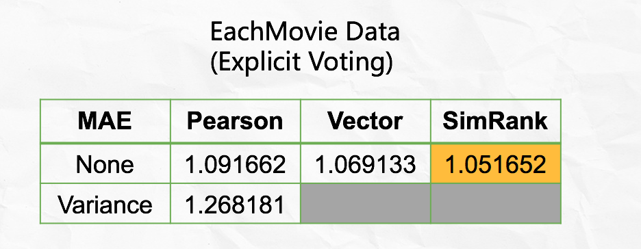
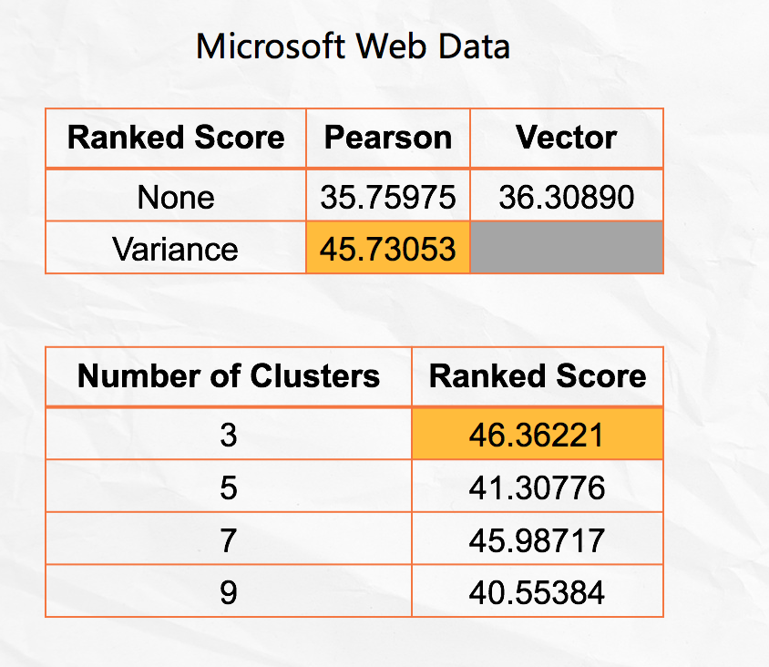

# Project 4: Collaborative Filtering

### [Project Description](doc/project4_desc.md)

Term: Spring 2018

+ Team # 1
+ Projec title: Collaborative Filtering
+ Team members
	+ Cao, Xinlei
	+ Guo, Xiaoxiao
	+ Li, Xinrou
	+ Utomo, Michael
	+ Wang, Jingyi
+ Project summary: The major work of this project is to implement, evaluate and compare algorithms for Collaborative Filtering. First, we implement the memory-based algorithms. We tried three kinds of similarity weights: Pearson correlation, vector similarity and SimRank. Then we applied variance weighting to Pearson correlation. And the method we used to select neigbors is weight threshold. Next, we did the model-based algorithm. We implemented the EM algorithm in order to solve the cluster model. Here are our results for the performances of these algorithms:



	
+ Contribution statement:
	+ Cao, Xinlei
	+ Guo, Xiaoxiao
	+ Li, Xinrou: processed and cleaned Moive data. wrote Simrank function and calculated its MAE and ROC error, combined with neighbor select function. wrote part of main and memory.R document.
	+ Utomo, Michael
	+ Wang, Jingyi

Following [suggestions](http://nicercode.github.io/blog/2013-04-05-projects/) by [RICH FITZJOHN](http://nicercode.github.io/about/#Team) (@richfitz). This folder is orgarnized as follows.

```
proj/
├── lib/
├── data/
├── doc/
├── figs/
└── output/
```

Please see each subfolder for a README file.
